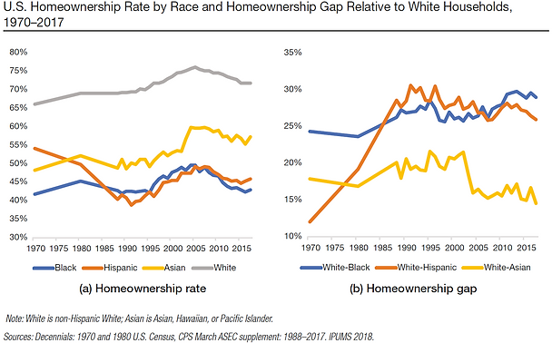
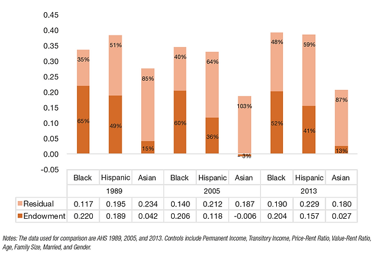

::: {.research-summary}

[← Back to Research](../research.html){.summary-back}

::: {.summary-citation}
**Citation:** Acolin, A., Lin, D., & Wachter, S. M. (2019). Endowments and minority homeownership. *Cityscape, 21*(1), 5–62.
:::

::: {.summary-figure}

:::

## Persistent White–Minority Homeownership Gaps

The ability to become a homeowner affects access to opportunity. Persistently lower homeownership outcomes contribute to limiting households’ ability to withstand negative shocks in times of economic crisis. Differential access to homeownership is both influenced by and has long-lasting impacts on intergenerational wealth building.

## What Explains the Homeownership Gaps?

Household and market endowment gaps are persistent forces in the past decades to explain a substantial share of the white–minority homeownership gaps for Black and Hispanic households.

::: {.summary-figure}

:::

[← Back to Research](../research.html){.summary-back .summary-back-bottom}

:::
