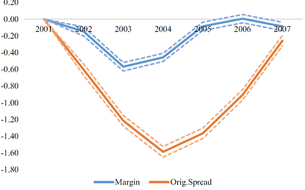
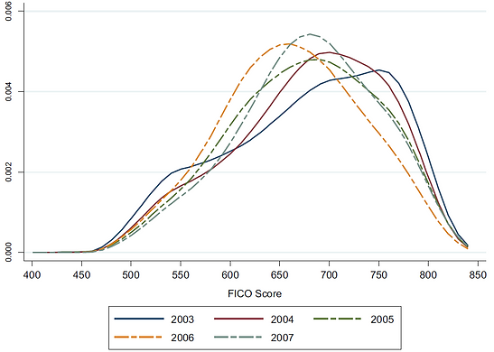
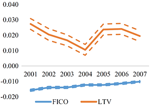
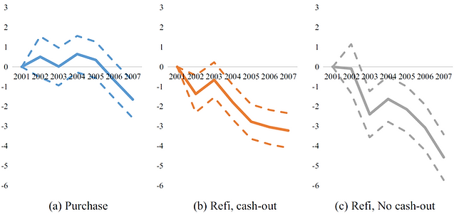

::: {.research-summary}

[← Back to Research](../research.html){.summary-back}

::: {.summary-citation}
**Citation:** Levitin, A. J., Lin, D., & Wachter, S. M. (2020). Mortgage risk premiums during the housing bubble. *The Journal of Real Estate Finance and Economics, 60*(4), 421–468.
:::

::: {.summary-figure}

:::

## How Was Mortgage Risk Priced before the 2008 Great Recession?

In the regression of mortgage risk (measured by the gross margin or the original interest rate spread), the coefficients on the vintage indicators of the adjustable-rate mortgage (ARM) show that mortgage risk in 2003/04 was priced substantially lower than the 2001 level.

## Borrower Characteristics Worsened before the Great Recession

The distribution of the credit score (FICO) of ARM borrowers skewed to the left in the years closer to the 2008 Great Recession.

::: {.summary-figure-grid}

:::

## Mortgage Risk Pricing Became Less Sensitive to Hard Information

The coefficients on the credit score (FICO) and the loan-to-value ratio (LTV) show decreasing impacts over time on the gross margin, the portion of the ARM rate reflecting the riskiness of a borrower.

In other words, high-risk borrowers were not charged a higher rate than low-risk borrowers to compensate for the default risk.

## What Are the Driving Forces of Mortgage Risk Underpricing?

In addition to the decreasing impacts of hard information on risk pricing, refinance loans mainly contributed to the underpricing of mortgage risk.

::: {.summary-figure}

:::

[← Back to Research](../research.html){.summary-back .summary-back-bottom}

:::
