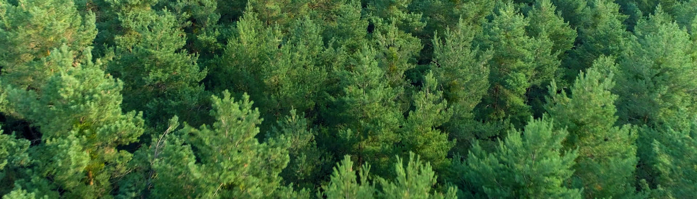
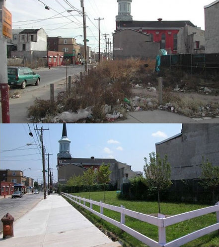
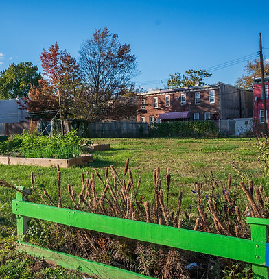
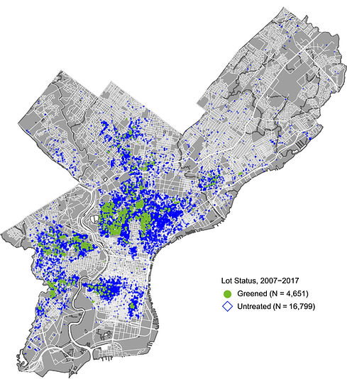
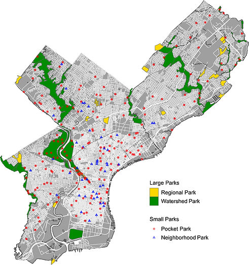
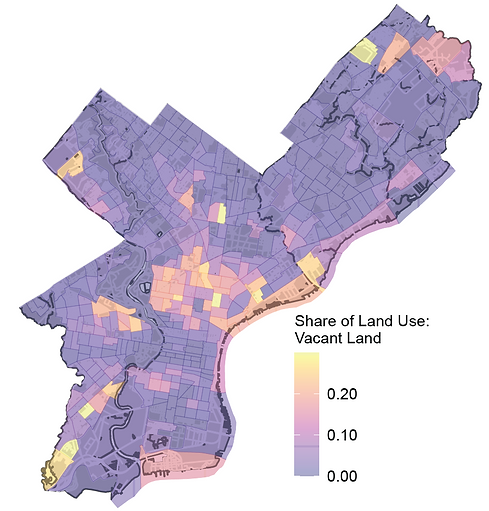
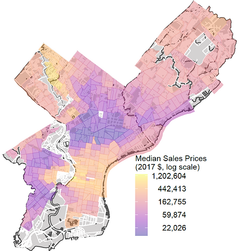
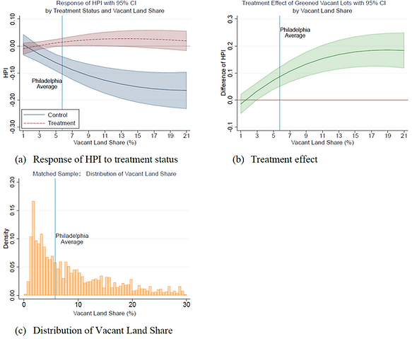

::: {.research-summary}

[← Back to Research](../research.html){.summary-back}

::: {.summary-citation}
**Citation:** Lin, D., Jensen, S. T., & Wachter, S. M. (2023). The price effects of greening vacant lots: How neighborhood attributes matter. *Real Estate Economics, 51*(3), 573–610. [https://doi.org/10.1111/1540-6229.12401](https://doi.org/10.1111/1540-6229.12401)
:::

::: {.summary-hero-image}

:::

> “Let every House be placed, if the Person pleases in the middle of its platt as to the breadth way of it, that so there may be ground on each side, for Gardens or Orchards or feilds [sic], that it, may be a greene Country Towne, [which] will never be burnt, and allways be wholsome.”
>
> — William Penn (1682)

::: {.summary-figure .summary-figure-narrow}

:::

## Transforming Vacant Land

Vacant lot “cleaning and greening” is a simple but potentially effective strategy for mitigating negative effects of blighted land on surrounding property values.

Philadelphia, long plagued by property abandonment, is a pioneer in remediation programs.

## LandCare in Philadelphia

The LandCare Program of the Pennsylvania Horticultural Society (PHS) was designed to be scalable and applicable for the many vacant lots in Philadelphia’s disinvested and distressed neighborhoods.

The key steps of vacant-lot remediation include:

- Removing trash and debris
- Grading the land
- Planting grass and some trees
- Installing low wooden post-and-rail fences with walk-in openings around the lot’s perimeter

::: {.summary-figure .summary-figure-narrow}

:::

::: {.summary-hero-image}

:::

## Greened Lots vs. Parks: The Same Green Space?

While parks and greened vacant lots can both supply green space to neighborhoods, they differ in two fundamental aspects: size and spatial distribution.

- Greened vacant lots are much smaller than pocket parks.
- Greened vacant lots are more concentrated in neighborhoods with lower median household income and a higher vacant-land share.

::: {.summary-figure-grid .summary-figure-grid-four}

:::

## Greened Lots Mitigate the Negative Price Effect of Land Vacancy

Properties within a 1,000-foot radius of a greened lot experience, on average, a 4.3% rise in value after the first year and a 13% cumulative increase after six years.

The treatment effect increases with the vacant-land share and reaches its peak around 19%, narrowing the pretreatment price gap (−21.9%) between a property next to a vacant lot and a property 1,000 feet away from a vacant lot.

::: {.summary-figure}

:::

::: {.summary-callout}
“The measured price effect benefits are an order of magnitude larger than the costs. Using the median priced home ($250,000) multiplied by the number of homes within 1,000 feet (about 18) and by the treatment effect (4.3%) results in a benefit of $193,500, or $9,675 annualized at a 5% discount rate, which exceeds the annualized cost of $375 ($300 upkeep and 5% of $1,500 installation cost).”
:::

## Vacant-Lot Greening Is Most Effective in Mid-Income Neighborhoods

The treatment effect increases with median household income in neighborhoods with 60–140% of the city’s median household income.

Neighborhoods with median household income 20–40% above the city’s median household income see the largest impact.

## Bigger Gardens or More Gardens?

The effects vary by the spatial intensity of greening activities: greened-lot concentration and landscape size.

With comparable total areas of vacant land, building more landscapes of smaller sizes has a larger impact on nearby properties.

The overall impact is most strongly related to the border, as opposed to the size, of the lot. Hence, these smaller lot conversions will have an outsized effect on nearby house values.

## Are Greened Lots and Parks Substitutes or Complements?

If greened lots and parks are substitutes, a smaller effect for properties closer to parks is expected. On the contrary, nearness to parks augments the price effect of vacant-lot greening.

Park size also matters. The treatment effect of vacant-lot greening comes from smaller parks. Greened lots are not substitutes for parks but complement pocket parks and small neighborhood parks to create green-space amenities.

## Is the Effect of Vacant-Lot Greening a Consequence of Crime Reduction?

No. The effect of greened vacant lots on housing prices is positive and significant only in census blocks below the 60th percentile of the crime-count distribution. Vacant-lot remediation is not a cure for all.

By comparing crime counts between neighborhoods with treated and control sales, we do not find evidence of substantial crime reduction in neighborhoods with treated sales.

This suggests that the positive price effect of vacant-lot greening is not mainly due to crime reduction but is associated with a direct amenity effect.

[← Back to Research](../research.html){.summary-back .summary-back-bottom}

:::
