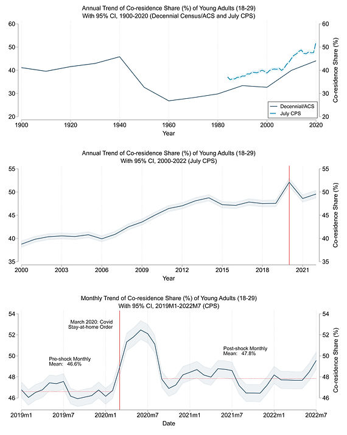
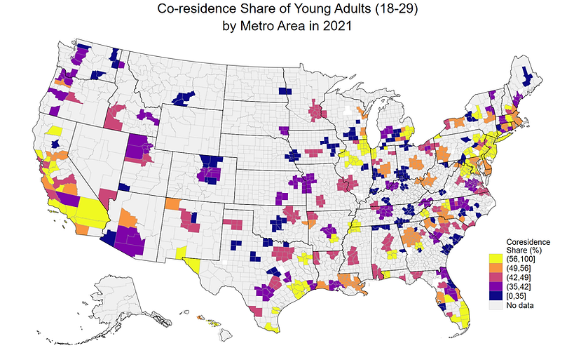
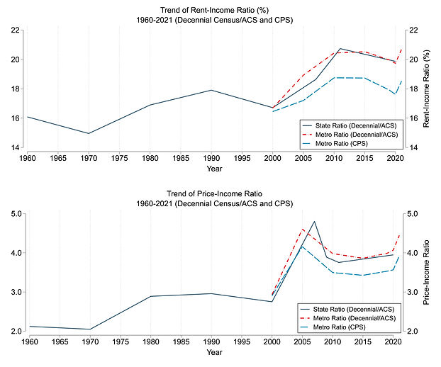
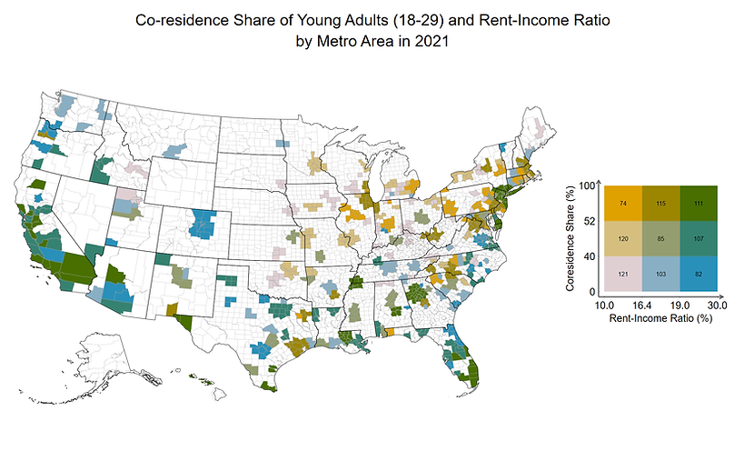
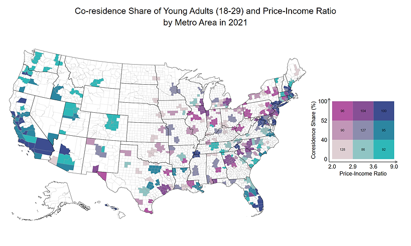

::: {.research-summary}

[← Back to Research](../research.html){.summary-back}

::: {.summary-citation}
**Citation:** Acolin, A., Lin, D., & Wachter, S. M. (2024). Why do young adults coreside with their parents? *Real Estate Economics, 52*(1), 7–44. [https://doi.org/10.1111/1540-6229.12467](https://doi.org/10.1111/1540-6229.12467)
:::

::: {.summary-hero-image}

:::

::: {.summary-figure .summary-figure-narrow}

:::

## Young-Adult Co-Residence at a Historic High since 1900

The co-residence share of young adults starts at 41% in 1900 and remains at this or a somewhat higher rate through 1940.

In the following two decades of post-World War II rapid growth, the co-residence share of young adults drops from 46% in 1940 to 27% in 1960, a period in which homeownership rapidly rises and then stabilizes from 1960 to 1990.

After 1960, the co-residence share increases every decade, except for a slight decrease during 1990–2000 when homeownership rises.

Since 2000, the co-residence share has increased from 39.9% to 49% as of March 2021. This is about twice the pace of the previous four decades.

::: {.summary-figure}

:::

## Housing Affordability at a Historic Low

Rent-income and price-income ratios rise from 1970 to 1990 before declining in the 1990s, a decade during which homeownership increases and the co-residence share decreases.

In 2000, measures of the housing-affordability burden begin increasing until their decline with the subprime recession of 2009, then rise again in 2010 and remain higher than at any point since 1960.

::: {.summary-figure-grid}

:::

By accounting for the response of marriage and childbearing decisions to the decline in housing affordability in young adults’ co-residence choices, we attribute up to a quarter of the observed 9-percentage-point increase in the co-residence share between 2000 and 2021 to a decrease in housing affordability.

## Blinder–Oaxaca Decomposition of the Co-Residence Share Change

When we account for marriage and childbearing delays due to the decline in affordability, the contribution of affordability to the 9-percentage-point change in the co-residence share increases to 2.3–2.4 percentage points.

Endogenizing the marriage–childbearing channel does not materially affect the contributions of endowments, except for unemployment and affordability.

## Co-Residence Choices Depend Strongly on Population Groups

The decomposition of co-residence change by race group shows that increased co-residence among White young adults during 2000–2021 is mostly attributed to marriage and childbearing delays and decreased housing affordability.

In comparison, increased co-residence among minority young adults is attributed to these two factors as well as changes in employment, immigration, and educational attainment during the period.

## Housing Affordability Becomes More Impactful on Co-Residence Choices

The effect of affordability becomes more pronounced over time.

The rent-income model shows a local peak of the marginal effect in 2005, increasing again until 2015 and then flattening. In the price-income model, the coefficient increases from 2000 to 2015, then flattens as well.

The growing importance of affordability in the co-residence decision over time could reflect a potential increase in the metro dispersion of rent-income and price-income ratios.

## Where Affordability Matters Most

The effects of the rent-income (price-income) ratio are stronger in the top quintiles of affordability measures, meaning that affordability is a more important factor in the co-residence decision in less affordable metros.

The finding of stronger affordability impacts in less affordable markets echoes the earlier finding of a more salient effect of affordability on co-residence in more recent years, reflecting the more binding nature of affordability in high-price and high-rent metros in the years after the Great Recession.

[← Back to Research](../research.html){.summary-back .summary-back-bottom}

:::
